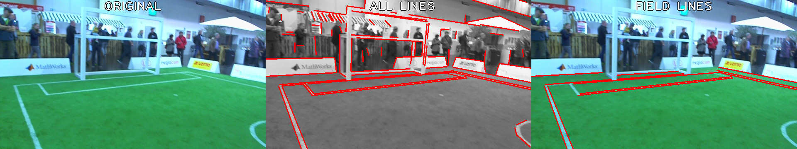

# ELSED+GC: Enhanced Line SEgment Drawing + Gradient Classification for Soccer Field Lines Detection

This repository adds a gradient classification to the [**ELSED: Enhanced Line SEgment Drawing**](https://doi.org/10.1016/j.patcog.2022.108619) algorithm, which allows us to classify line segments based on their color transitions in the RGB color space. Our implementation aims at classifying if the detected line segments belong to a soccer field or not, but it can be modified to address other types of line segments.



## Dependencies (TO DO)

## Running

### Compiling ELSED

The code can be compiled with Cmake:

```shell script
mkdir build && cd build
cmake .. && make
```


### Using ELSED+GC from python

Here is an example code on how to run ELSED+GC in a single image and highlight lines classification on screen. Lines classified as "not a field feature" are painted in black.

```python
import cv2
from elsed_analyzer import SegmentsAnalyzer

analyzer = SegmentsAnalyzer(draw_on_frames=True)

img_path = 'images/test_image.jpg'

img = cv2.imread(img_path)

analyzer.detect(img)

cv2.imshow('detections', img)
cv2.waitKey(0)
cv2.destroyAllWindows()
```

Note that, the default thresholds in the [SegmentsAnalyzer](https://github.com/jgocm/ELSED-SSL/blob/7ad8fd7f30dbffbc468e7423627862db6ea3e17d/elsed_analyzer.py#L9) class are adjusted for our soccer field. To apply ELSED+GC to a new envinroment, the thresholds should be readjusted accordingly. This adjusment can be done manually or by following our thresholds training pipeline.

## Available Datasets and Thresholds (TO DO)

## Thresholds Training Pipeline
The procedure to adjust thresholds to a new soccer field consists of 4 main steps:
1. Collecting images
2. Annotating training data
3. Traning thresholds with PSO
4. Loading thresholds from the numpy file

### Collecting images
Take pictures of your environment from multiple perspectives to ensure all the lines were seen by different points of view.

Another way to collect it is by recording a video from the robot's camera and extracting frames from it. The [select_frames_from_video.py](https://github.com/jgocm/ELSED-SSL/blob/62eccad56d3c2046fa6a192f25bea43ca581923f/select_frames_from_video.py) script helps saving frames from a video.

### Annotating training data
[annotate_trainings.py](https://github.com/jgocm/ELSED-SSL/blob/62eccad56d3c2046fa6a192f25bea43ca581923f/annotate_trainings.py)

### Training with PSO
[train_and_evaluate_marking_thresholds.py](https://github.com/jgocm/ELSED-SSL/blob/62eccad56d3c2046fa6a192f25bea43ca581923f/train_and_evaluate_marking_thresholds.py)

### Loading thresholds
```python
import cv2
import numpy as np
from elsed_analyzer import SegmentsAnalyzer

PATH_TO_THRESHOLDS = 'trainings/humanoid-kid/marking_thresholds_40.npy'
markings_thresholds = np.load(PATH_TO_THRESHOLDS)

analyzer = SegmentsAnalyzer(marking_thresholds=markings_thresholds, 
                            draw_on_frames=True)

img_path = 'images/test_image.jpg'

img = cv2.imread(img_path)

analyzer.detect(img)

cv2.imshow('detections', img)
cv2.waitKey(0)
cv2.destroyAllWindows()

```

## Cite

### Efficient Lines Detection for Robot Soccer 
Published at RoboCup 2025, still no DOI available

### [**ELSED: Enhanced Line SEgment Drawing**](https://doi.org/10.1016/j.patcog.2022.108619)
```bibtex
@article{suarez2022elsed,
      title={ELSED: Enhanced Line SEgment Drawing}, 
      author={Iago Suárez and José M. Buenaposada and Luis Baumela},
      journal = {Pattern Recognition},
      volume = {127},
      pages = {108619},
      year = {2022},
      issn = {0031-3203},
      doi = {https://doi.org/10.1016/j.patcog.2022.108619},
      url = {https://www.sciencedirect.com/science/article/pii/S0031320322001005}
}
```
